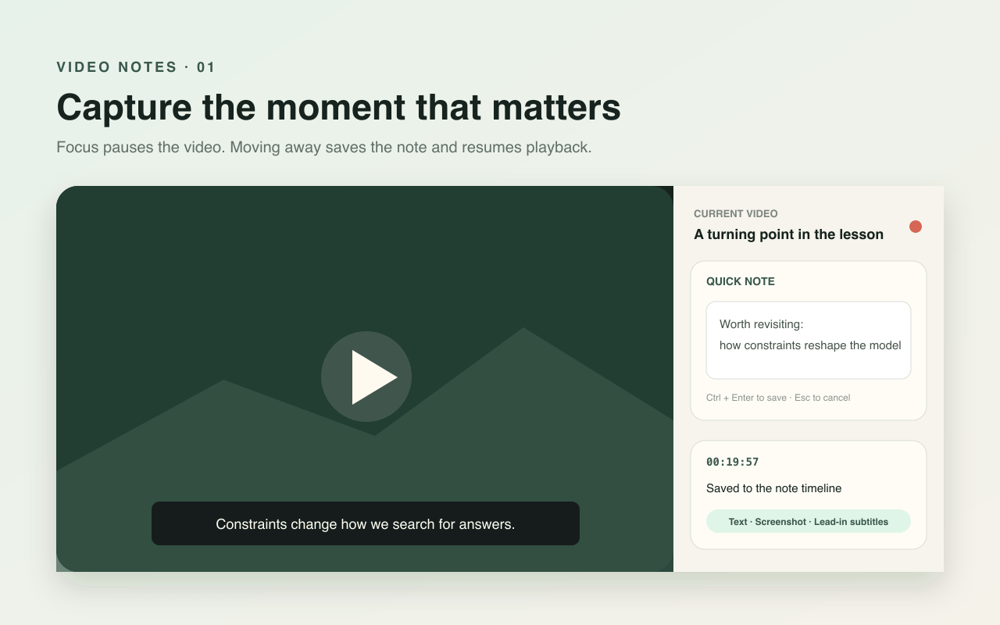

<p align="center"><strong>English</strong> · <a href="README.zh-CN.md">简体中文</a></p>

<p align="center">
  
</p>

<h1 align="center">Video Notes</h1>

<p align="center">Capture timestamps, screenshots, subtitles, and your own thoughts while watching a lesson.</p>

Video Notes is an open-source extension for desktop Microsoft Edge and Google Chrome. It keeps a note panel visible beside YouTube and Bilibili videos, placing typed notes, player screenshots, lead-in subtitles, local voice transcription, and Markdown export on one timeline.



## What it does

- Pauses the video when you focus the quick-note editor, then saves and resumes when you move focus away.
- Stores the video timestamp, an optional player screenshot, and the previous 5, 10, 20, or 30 seconds of subtitles with each note.
- Reads native YouTube and Bilibili subtitles, plus bilingual subtitles rendered by Immersive Translate.
- For YouTube videos with available native captions, shows the full transcript locally with its coverage range, configurable 5, 10, or 20-segment reading groups, independent font-size controls, and timestamp jumps.
- Translates a complete YouTube transcript locally with the built-in Edge/Chrome Translator API. It detects the transcript language automatically and lets you choose Simplified Chinese, English, Japanese, Korean, or Spanish as the target, with advance download and visible progress for the current language pair.
- Records while you hold Right Option/Alt or the side-panel button, then restores eligible playback when you release.
- Runs Base, Small, or Medium Whisper models locally in the browser.
- Shows notes oldest-first or newest-first, with edit, delete, clear, undo, and redo controls.
- Exports a ZIP containing Markdown, screenshots, and original recordings.

## Install

### Microsoft Edge Add-ons

Version 1.0.20 is being prepared for the first Microsoft Edge Add-ons review. Once the listing is available, the website will point its primary install action to the store.

### GitHub Release preview

[Download Video Notes 1.0.20 ZIP](https://github.com/IronUnicorn66/video-notes/releases/download/v1.0.20/video-notes-edge-1.0.20.zip)
· [SHA-256 checksum](https://github.com/IronUnicorn66/video-notes/releases/download/v1.0.20/video-notes-edge-1.0.20.zip.sha256)

1. Download the ZIP and extract it to a permanent folder.
2. Open `edge://extensions/` in Edge or `chrome://extensions/` in Chrome.
3. Turn on **Developer mode**.
4. Select **Load unpacked**.
5. Choose the extracted folder that directly contains `manifest.json`.

Preview builds require manual updates. Download the new release into the same folder, then select **Reload** on the extension management page.

## Use

1. Open a standard YouTube video or a Bilibili BV video, then select Video Notes in the Edge toolbar.
2. Select the quick-note editor, type your thought, and move focus away. You can also press `Cmd/Ctrl + Enter` to save or `Esc` to cancel.
3. Open **Settings** to enable player screenshots, microphone access, lead-in subtitles, or download a local translation language pack in advance.
4. Hold Right Option/Alt or **Hold to talk** when you want to add a voice note.
5. Select and download a pinned Whisper model for local transcription. After the download, transcription can run offline.
6. Select **Export ZIP** when you finish. Exporting does not delete notes from the browser.

## Local data and network access

Notes, subtitles, screenshots, recordings, and transcription results stay in extension storage on your device. Video Notes has no account system, advertising, or analytics, and it does not upload this content to the developer.

When you first download a Whisper model, the extension retrieves static weights from a pinned `ggerganov/whisper.cpp` revision on Hugging Face, verifies the exact size and SHA-256, and caches the model locally. All JavaScript, Worker, and WASM code ships inside the extension package. The download service receives normal HTTPS connection metadata such as IP address, User-Agent, request time, and model file URL; the request contains no notes or media content.

Full transcripts are translated only in the side-panel document with the browser’s built-in Translator API. The source language is detected from the transcript track. The first release lets you choose Simplified Chinese, English, Japanese, Korean, or Spanish as the target. After the full transcript loads, you can download the current source-to-target pack in advance and follow its progress; the interface shows an estimated 200 MiB footprint only after it is ready. Translation then works offline. Edge and Chrome manage their packs separately, so actual disk use, support, and output can differ. The extension never sends transcript content to the developer or a third-party translation service.

- [Product website](https://ironunicorn66.github.io/video-notes/en/)
- [Privacy policy](https://ironunicorn66.github.io/video-notes/en/privacy/)
- [Support](https://github.com/IronUnicorn66/video-notes/issues)

The repository and existing issues are public. Creating a new issue requires a GitHub login.

## Local development

Requires Node.js 22 or later.

```bash {.line-numbers}
npm install
npm test
npm run build
npm run package
unzip -t artifacts/video-notes-edge-1.0.20.zip
cd artifacts && shasum -a 256 -c video-notes-edge-1.0.20.zip.sha256
```

After building, load the project’s `dist` directory from `edge://extensions/` or `chrome://extensions/`.

## Supported environments

- Standard YouTube video pages.
- Standard Bilibili BV video pages, including multi-part videos.
- Microsoft Edge 150 or later on desktop.
- Google Chrome 138 or later on desktop.

Lead-in subtitles are read from content already rendered by the player. When complete YouTube transcript retrieval is blocked, the side panel may briefly toggle the YouTube captions control to capture the native caption response requested by the player, then restore its prior state. This stays local to the browser and does not use a private site API or a third-party subtitle service. Whisper performance depends on model size, device memory, and recording quality.

## Contributing and security

- Questions and feature requests: [GitHub Issues](https://github.com/IronUnicorn66/video-notes/issues)
- Security reports: follow the [security policy](SECURITY.md) for private reporting.
- Detailed permission and data notes: [local data and permissions](docs/PRIVACY.md)
- Microsoft Edge listing material: [store listing copy](docs/STORE_LISTING.md)
- Third-party components: [THIRD_PARTY_NOTICES.md](THIRD_PARTY_NOTICES.md)

## License

Video Notes is available under the [MIT License](LICENSE). Third-party components remain subject to their own licenses.
