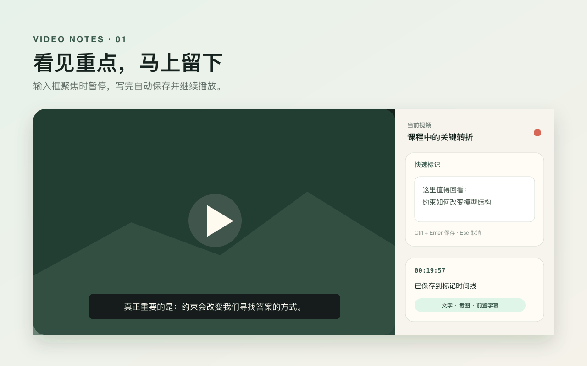

<p align="center"><strong>简体中文</strong> · <a href="README.md">English</a></p>

<p align="center">
  
</p>

<h1 align="center">视频笔记</h1>

<p align="center">看课程时快速留下时点、截图、字幕和自己的想法。</p>

视频笔记是一款面向桌面版 Microsoft Edge 和 Google Chrome 的开源扩展。它在 YouTube 和哔哩哔哩视频旁提供持续可见的笔记侧栏，让文字记录、播放器截图、标记前字幕、本地语音转写和 Markdown 导出保持在同一条时间线上。



## 核心能力

- 点击快速标记输入框时暂停视频，移开焦点后自动保存并续播。
- 每条笔记保存视频时点、播放器截图和可配置的标记前 5、10、20 或 30 秒字幕；当前 YouTube 完整字幕已加载时，优先复用本地完整段落，选中范围全部翻译后同时保存对应译文。
- 支持 YouTube、哔哩哔哩原生字幕，以及沉浸式翻译呈现的双语字幕。
- 对已暴露原生字幕轨道的 YouTube 视频显示完整字幕、覆盖范围、按完整句调整边界的 5/10/20 条合并阅读、独立字号调节、原文/译文显示选择、时间跳转和播放器当前进度定位。
- 使用语言切换左侧的 `+`、`−` 按钮，以 10% 为一档在 75%–200% 之间调整整个侧栏大小。
- 切换标签页时保持浏览器原生侧栏的开关状态，并在返回时恢复各标签页离开前的侧栏滚动位置；普通网页只显示本地提示，不授予插件读取页面内容的权限。
- 使用 Edge/Chrome 内置 Translator API 在本机按完整句段落翻译字幕；自动识别字幕语言，首版可选择简体中文、英语、日语、韩语或西班牙语作为目标语言，并提前下载当前语言对。
- 按住右 Option/Alt 或侧栏按钮录音，松开后恢复播放。
- Base、Small、Medium 三种 Whisper 模型均在浏览器本机运行。
- 正序或倒序查看时间线，支持编辑、删除、清空、弯箭头撤销/反撤销，以及持久化的 10–24px 笔记字号调节。
- 导出 ZIP，包含 Markdown、截图和原始录音。

## 安装

### Edge 商店

1.0.28 正在准备 Microsoft Edge Add-ons 首次审核。商店页面开放后，官网会把主安装入口切换为商店安装。

### GitHub Release 测试版

[下载视频笔记 1.0.28 ZIP](https://github.com/IronUnicorn66/video-notes/releases/download/v1.0.28/video-notes-edge-1.0.28.zip)
· [SHA-256 校验文件](https://github.com/IronUnicorn66/video-notes/releases/download/v1.0.28/video-notes-edge-1.0.28.zip.sha256)

1. 下载 ZIP 并解压到固定目录。
2. 在 Edge 地址栏打开 `edge://extensions/`，或在 Chrome 打开 `chrome://extensions/`。
3. 开启“开发人员模式”。
4. 点击“加载解压缩的扩展”。
5. 选择解压后的目录；该目录内应直接包含 `manifest.json`。

测试版需要手动更新。新版本发布后，请重新下载并覆盖原目录，再在扩展管理页点击“重新加载”。

## 使用方法

1. 打开 YouTube 普通视频页或哔哩哔哩 BV 视频页，点击工具栏中的“视频笔记”。
2. 点击快速标记输入框，输入想法后移开焦点；也可以按 `Cmd/Ctrl + Enter` 保存，按 `Esc` 取消。
3. 在“设置”中按需启用播放器截图、麦克风、前置字幕，或提前下载本地翻译语言包。
4. 需要语音记录时，按住右 Option/Alt 或“按住说话”按钮。
5. 需要本地转写时，选择并下载固定的 Whisper 模型；下载完成后可离线转写。
6. 看完后点击“导出 ZIP”。导出不会删除浏览器中的笔记。

## 本地数据与联网范围

笔记、字幕、截图、录音和转写结果保存在扩展自己的浏览器存储中，不会上传给开发者。扩展不包含账户、广告或分析统计。

首次下载 Whisper 模型时，扩展会从 `ggerganov/whisper.cpp` 的固定 Hugging Face revision 下载静态权重，校验固定文件大小和 SHA-256 后缓存到本机。JavaScript、Worker 和 WASM 全部包含在扩展安装包中。下载服务会收到普通 HTTPS 请求的 IP、User-Agent、请求时间和模型文件地址等连接元数据；请求不包含用户笔记或媒体内容。

完整字幕只通过浏览器内置 Translator API 在侧栏文档中本地翻译。扩展从字幕轨道自动识别源语言，首版允许用户选择简体中文、英语、日语、韩语或西班牙语作为目标语言；当前合并档位全部翻译完成后，可以选择只看原文、只看译文或同时查看，并在本机保存显示偏好。读取完整字幕后，也可以提前下载当前源语言到目标语言的语言包并查看进度。下载完成后才显示约 200 MiB 的预估占用，之后可断网翻译。Edge 与 Chrome 分别管理自己的语言包，实际占用、支持状态和翻译结果可能不同。扩展不会把字幕发送给开发者或第三方翻译服务。

- [产品主页](https://ironunicorn66.github.io/video-notes/)
- [隐私政策](https://ironunicorn66.github.io/video-notes/privacy/)
- [问题反馈](https://github.com/IronUnicorn66/video-notes/issues)

仓库和现有问题可公开读取；提交新问题需要登录 GitHub。仓库已启用公开 Issues。

## 本地开发

要求 Node.js 22 或更高版本。

```bash {.line-numbers}
npm install
npm test
npm run build
npm run package
unzip -t artifacts/video-notes-edge-1.0.28.zip
cd artifacts && shasum -a 256 -c video-notes-edge-1.0.28.zip.sha256
```

构建完成后，在 `edge://extensions/` 或 `chrome://extensions/` 中加载本项目的 `dist` 目录。

## 支持范围

- YouTube 普通视频页。
- 哔哩哔哩普通 BV 视频页与分 P。
- 桌面版 Microsoft Edge 150 或更高版本。
- 桌面版 Google Chrome 138 或更高版本。

笔记的前置字幕优先读取当前会话已经加载的 YouTube 完整字幕，并在选中范围全部翻译后把对应译文一起保存；本地来源不可用时才读取播放器已经渲染的内容。完整字幕读取遇到平台限制时，扩展可能短暂切换 YouTube 的字幕开关以捕获播放器发起的原生字幕响应，随后恢复原先状态；不调用视频网站的私有字幕接口。Whisper 性能取决于模型大小、设备内存和录音质量。

## 贡献与安全

- 一般问题与功能建议：[GitHub Issues](https://github.com/IronUnicorn66/video-notes/issues)
- 安全问题：请按 [安全政策](SECURITY.md) 私下报告。
- 详细权限与数据说明：[本地数据与权限](docs/PRIVACY.md)
- Edge 上架资料：[商店发布文案](docs/STORE_LISTING.md)
- 第三方组件：[THIRD_PARTY_NOTICES.md](THIRD_PARTY_NOTICES.md)

## 许可证

本项目使用 [MIT License](LICENSE)。第三方组件继续遵循各自许可证。
